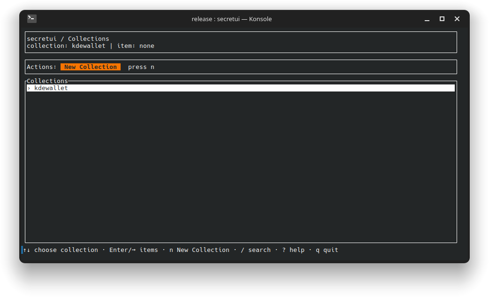

# secretui

**The credentials were there. The password manager said they weren't.**

`secretui` is a keyboard-driven terminal interface for browsing, inspecting, and maintaining credentials stored through the Linux [Secret Service API](https://specifications.freedesktop.org/secret-service/latest/).

It lets you see what applications actually stored (even when the provider's usual interface does not show it) and work with arbitrary labels and attributes without assuming that every credential is just a username and password.



## Why I built it

While working with [RustConn](https://github.com/totoshko88/RustConn), I found credentials in KWallet's Secret Service storage that were invisible in KWallet Manager.

The entries existed. Applications had created them. But the interface I expected to use could not show me what was there.

That sent me through D-Bus calls, attribute queries, and tools that worked only when I already knew what I was looking for. I wanted something simpler: open a terminal, browse the store, inspect the real record, and fix its metadata safely.

That is what became `secretui`.

The original problem is described in this [KDE discussion](https://discuss.kde.org/t/why-is-my-git-secret-not-visible-in-kwalletmanager-but-visible-in-seahorse-gui/43532).

## What you can do

With `secretui`, you can:

- browse Secret Service collections and items interactively;
- search entries without knowing their attributes in advance;
- inspect application-defined labels and arbitrary attributes;
- create, rename, edit, and delete collections or items;
- reveal or copy a secret only after an explicit action;
- view text secrets safely or copy binary values as Base64 or hex;
- export secret-free metadata for inspection;
- preview and apply conflict-checked metadata repairs within the same provider database; and
- use the same workflow locally, in a minimal desktop, or through a remote terminal that already has access to the user's Secret Service session.

`secretui` is an administration and troubleshooting tool. It is not intended to replace a full password manager or an infrastructure secret manager.

## Where it fits

Existing tools solve related (but different) problems:

- [libsecret](https://gitlab.gnome.org/GNOME/libsecret) provides `secret-tool`, which is effective when you already know the attributes to query.
- [`lssecret`](https://github.com/gileshuang/lssecret) lists stored entries and metadata.
- [keepsecret](https://github.com/KDE/keepsecret/) provides a graphical Secret Service-native interface.
- `secretui` gives you an interactive terminal workflow for discovery, inspection, editing, and same-store metadata repair.

## Installation

### Prebuilt binary

The published binary targets x86-64 Linux and requires glibc 2.34 or newer.

Download the archive and checksum from the same release, verify them, and install the binary for your user:

```bash
VERSION=v0.1.4
ARCHIVE="secretui-${VERSION}-x86_64-unknown-linux-gnu.tar.gz"

curl -fLO \
  "https://github.com/edwordout/secretui/releases/download/${VERSION}/${ARCHIVE}"
curl -fLO \
  "https://github.com/edwordout/secretui/releases/download/${VERSION}/SHA256SUMS"

sha256sum --check SHA256SUMS
tar -xzf "$ARCHIVE"

mkdir -p ~/.local/bin
install -m755 "${ARCHIVE%.tar.gz}/secretui" ~/.local/bin/secretui

secretui --version
```

Make sure `~/.local/bin` is on your `PATH`.

The release archive also contains the man page, Bash completion, documentation, and licenses.

### Build from source

Source builds require Rust 1.97.0 and Cargo:

```bash
git clone https://github.com/edwordout/secretui.git
cd secretui

cargo install --path . --locked
secretui --version
```

## Using the TUI

Start it with:

```bash
secretui
```

The main flow is:

```text
Collections → Items → Details
```

Common keys:

| Key | Action |
| --- | --- |
| `↑` / `↓` or `j` / `k` | Move |
| `Enter`, `→`, `l`, or `Tab` | Open or move forward |
| `Esc`, `←`, or `h` | Go back |
| `/` | Search |
| `n` | Create a collection or item |
| `r` | Reveal from the Details screen |
| `?` | Show help |

Create and edit operations stay inside the TUI. Destructive confirmations start on **Cancel**, and secret replacement is kept separate from metadata editing.

## Metadata inspection and repair

Export metadata without retrieving secret values:

```bash
secretui export --metadata metadata.json
```

Preview a repair plan:

```bash
secretui import --metadata metadata.json
```

Apply it after the full preflight succeeds:

```bash
secretui import --metadata metadata.json --apply
```

You can also choose explicit recovery and report paths:

```bash
secretui import --metadata metadata.json --apply \
  --recovery recovery.json \
  --report report.json
```

This workflow is deliberately narrow:

- it repairs labels and attributes in the **same provider database**;
- it matches exact collection and item object paths;
- any conflict blocks all writes;
- it does not migrate secrets between providers; and
- metadata files never contain secret bytes.

Metadata can still expose account names, services, internal hosts, and usage patterns. Treat exported metadata, recovery files, and reports as sensitive.

See [METADATA.md](METADATA.md) for the complete format and limits.

## Safety by default

`secretui` is designed to make sensitive actions visible and deliberate:

- browsing and metadata export do not retrieve secret values;
- reveal, copy, save, delete, and apply actions require explicit input;
- secret previews are escaped, limited, and expire after 30 seconds;
- owned secret buffers are zeroized when discarded;
- temporary unlocks are relocked and verified during ordinary shutdown paths;
- metadata edits do not silently replace secret contents; and
- secret bytes are kept out of exports, repair plans, reports, rendered errors, and operation logs.

Clipboard clearing after 30 seconds is best-effort. Clipboard history, screen capture, privileged processes, a compromised desktop session, or forced termination remain outside the tool's protection.

Read [SECURITY.md](SECURITY.md) for the threat model and private vulnerability-reporting instructions.

## Remote and headless sessions

`secretui` uses the Secret Service provider already running in the user's login session. It does not create a D-Bus session, start a provider, or unlock a wallet noninteractively.

A remote session must already be able to reach the user's session bus and provider. When the provider needs to display an authorization prompt, access to the graphical session may still be required.

Clipboard operations use the clipboard available to the process running `secretui`; over SSH, that is not automatically your local machine's clipboard.

For boot-time services, unattended systems, containers, and orchestration, use a purpose-built facility such as systemd credentials, Vault, a cloud secret manager, or your platform's secret mechanism.

## Compatibility

The v0.1.4 release artifact:

- targets `x86_64-unknown-linux-gnu`;
- is dynamically linked;
- is built on Ubuntu 22.04;
- requires glibc 2.34 or newer; and
- is not a universal or static Linux binary.

Secret Service providers can behave differently. The v0.1.4 live compatibility gate has not yet been completed successfully for KWallet, GNOME Keyring, or KeePassXC. Reports using synthetic metadata are welcome.

## Troubleshooting

### No session bus

Run `secretui` as the logged-in desktop user. Commands launched through `sudo`, cron, a bare TTY, or many containers may not inherit the correct `DBUS_SESSION_BUS_ADDRESS`.

### Provider unavailable

Confirm that a Secret Service provider is installed, enabled, and running in the same user session.

### Unlock prompt missing

Check the graphical desktop session. A provider prompt may be hidden, dismissed, or unavailable in a headless environment.

### Clipboard unavailable

The process needs access to a working graphical clipboard. Remote clipboard operations target the remote session.

### Terminal state looks broken

After an interrupted process, run:

```bash
reset
```

or:

```bash
stty sane
```

Then inspect the provider's lock state with a trusted tool.

## Development

```bash
cargo fmt --check
cargo clippy --locked --all-targets --all-features -- -D warnings
cargo test --locked --all-targets
RUSTDOCFLAGS='-D warnings' cargo doc --locked --no-deps
```

The ignored live-provider integration test creates temporary objects:

```bash
SECRETUI_INTEGRATION=1 \
  cargo test --locked --test integration_secret_service -- --ignored --nocapture
```

Review the test before running it against any provider that contains important credentials.

Release and project details live in:

- [CHANGELOG.md](CHANGELOG.md)
- [RELEASE.md](RELEASE.md)
- [SECURITY.md](SECURITY.md)
- [METADATA.md](METADATA.md)

## License

Licensed under either of:

- Apache License, Version 2.0
- MIT License

at your option.
